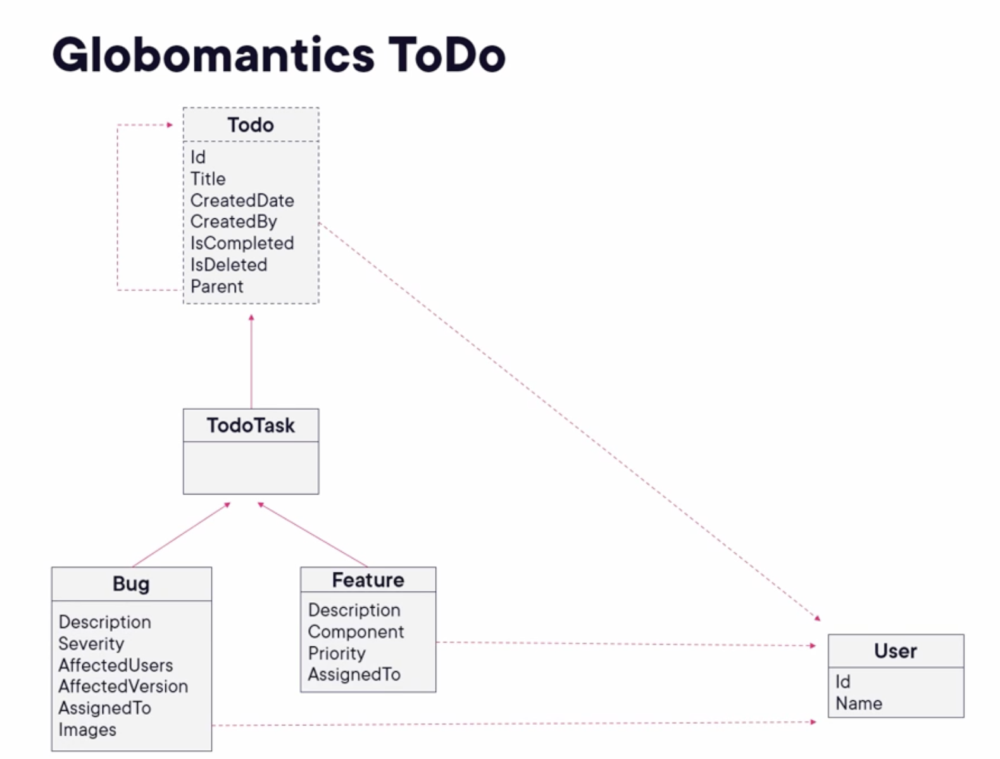

# Building a real-world C# application

Pluralsight course that utilises C# skills to build a to-do application. The UI have been provided but the code itself will be created during the course.
The link can be found [here.](https://app.pluralsight.com/ilx/video-courses/c-sharp-10-building-real-world-application/course-overview)

This diagram explores the features of the application:

## The architecture
The application is organised as follows:
* Domain: models representing the data and types used in the domain. Expressed in a similar language as the business would use.
* Infrastructure: interaction with external systems such as databases, services and the file system.
* UI: the definition of the UI and its components. This may be divided into multiple different projects as well, if the UI components are shared among multiple applications.

