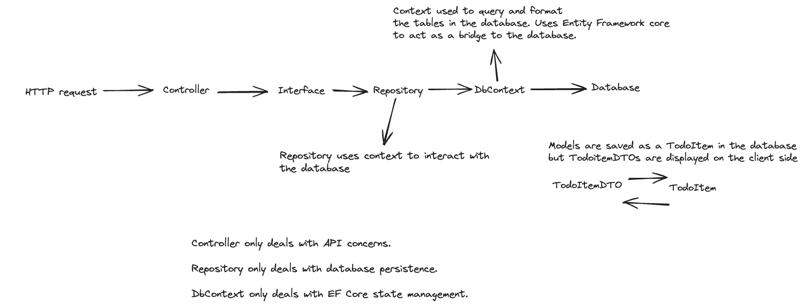

# Controller based web API
A controller based web API program with ASP.NET Core from this [tutorial.](https://learn.microsoft.com/en-us/aspnet/core/tutorials/first-web-api?view=aspnetcore-9.0&tabs=visual-studio)
## To do list
First feature is a to do list that implements CRUD operations.

| API                        | Description	            | Request body | Response body        |
|----------------------------|-------------------------|--------------|----------------------|
| GET /api/todoitems	        | Get all to-do items	    | None	        | Array of to-do items |
| GET /api/todoitems/{id}    | Get an item by ID	      | None	        | To-do item           |
| POST /api/todoitems	       | Add a new item	         | To-do item	  | To-do item           |
| PUT /api/todoitems/{id}    | Update an existing item | To-do item	  | None                 |
| DELETE /api/todoitems/{id} | Delete an item    	     | None	        | None                 |

How the call chain works
Controller → Calls _todoRepository.GetTodoItems() (through the ITodoRepository interface).

Repository → TodoRepository.GetTodoItems() runs await _todoContext.TodoItems.ToListAsync().

DbContext → TodoContext uses EF Core to execute SQL against the database table TodoItems.

Result → The returned list of TodoItem entities is projected into DTOs and returned to the API client.

HTTP request → 
Routing matches api/Todo/{id} → 
TodoController action runs → 
calls ITodoRepository (interface) → 
TodoRepository (implementation) uses TodoContext (EF Core DbContext) → 
hits the database → 
back up the chain → 
controller maps Entity (i.e TodoItem) → 
DTO → 
returns ActionResult<T> → 
ASP.NET Core serializes JSON + HTTP status.
